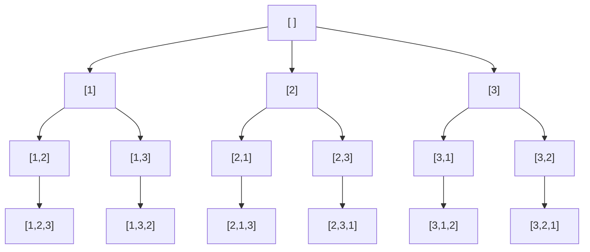

# Backtracking（回溯法）完整解說

> 本專案為 .NET 10 / C# 14 Console 應用程式，搭配六題經典範例，示範回溯法（Backtracking）與剪枝（Pruning）技巧。所有可執行程式碼位於 [`BackTrack/Problems/`](BackTrack/Problems/)。

---

## 目錄（Table of Contents）

1. [什麼是回溯法（What is Backtracking）](#1-什麼是回溯法what-is-backtracking)
2. [核心原理（Core Principle）](#2-核心原理core-principle)
3. [剪枝（Pruning）](#3-剪枝pruning)
4. [應用場景（Use Cases）](#4-應用場景use-cases)
5. [優缺點（Pros & Cons）](#5-優缺點pros--cons)
6. [複雜度分析（Complexity Analysis）](#6-複雜度分析complexity-analysis)
7. [經典題目與解法（Classic Problems & Solutions）](#7-經典題目與解法classic-problems--solutions)
8. [學習路徑與延伸題目（Further Reading）](#8-學習路徑與延伸題目further-reading)
9. [如何執行本專案（How to Run）](#9-如何執行本專案how-to-run)
10. [名詞對照表（Glossary）](#10-名詞對照表glossary)

---

## 1. 什麼是回溯法（What is Backtracking）

### 1.1 定義（Definition）

**回溯法（Backtracking）** 是一種以 **深度優先搜尋（Depth-First Search, DFS）** 走訪 **狀態空間樹（State Space Tree）** 的問題求解方法。它的精髓在於：

> 「**做選擇** → **遞迴探索** → **撤銷選擇**」，當發現當前路徑無法滿足條件時立即返回上一層，嘗試其他可能。

### 1.2 與暴力搜尋（Brute Force）的差異

| 比較 | 暴力搜尋（Brute Force） | 回溯法（Backtracking） |
| --- | --- | --- |
| 搜尋方式 | 列舉所有候選解後再驗證 | 邊建構邊驗證，不合法即剪枝 |
| 是否剪枝 | 否 | 是 |
| 效率 | 低 | 通常顯著提升 |
| 解空間 | 完整列舉 | 只走可行子樹 |

### 1.3 與分支限界法 / DFS / 動態規劃的關係

- **DFS**：回溯法是 DFS 在「狀態空間樹」上的特化應用，外加「撤銷狀態」的動作。
- **分支限界法（Branch and Bound, B&B）**：在回溯的基礎上加入「界值函數」做最優化剪枝，常用於 **最佳化問題**（如 0/1 背包）。回溯著重「找解 / 找全部解」，B&B 著重「找最優解」。
- **動態規劃（Dynamic Programming, DP）**：DP 適用於有「重疊子問題」與「最佳子結構」的場景，透過記憶化避免重算；回溯則用於「子問題彼此獨立、需要枚舉所有可行解」的場景。

---

## 2. 核心原理（Core Principle）

### 2.1 狀態空間樹（State Space Tree）

回溯法把問題的所有可能狀態組織成一棵樹：
- **根節點**：初始空狀態
- **內部節點**：部分解（Partial Solution）
- **葉節點**：完整解或死路（Dead End）
- **邊**：一次「選擇」

### 2.2 三步驟模型：選擇 → 遞迴 → 撤銷

```
function backtrack(state):
    if isGoal(state):
        record(state)
        return
    for choice in candidates(state):
        if isValid(choice, state):       // 剪枝點
            apply(choice, state)         // 1. 選擇 Choose
            backtrack(state)             // 2. 遞迴 Explore
            undo(choice, state)          // 3. 撤銷 Un-choose
```

### 2.3 通用模板（Pseudo Code Template）

C# 風格模板：

```csharp
void Backtrack(State state, List<Result> results)
{
    if (IsGoal(state))
    {
        results.Add(state.Snapshot());
        return;
    }

    foreach (var choice in Candidates(state))
    {
        if (!IsValid(choice, state)) continue;   // 剪枝
        Apply(choice, state);                    // 選擇
        Backtrack(state, results);               // 遞迴
        Undo(choice, state);                     // 撤銷
    }
}
```

### 2.4 遞迴樹圖示（State Space Tree）

以 **Permutations([1,2,3])** 為例：

#### Mermaid 圖



#### ASCII 備援

```
                          [ ]
            ┌──────────────┼──────────────┐
          [1]            [2]            [3]
         ┌─┴─┐          ┌─┴─┐          ┌─┴─┐
       [1,2][1,3]     [2,1][2,3]     [3,1][3,2]
         │   │          │   │          │   │
      [1,2,3][1,3,2] [2,1,3][2,3,1] [3,1,2][3,2,1]
```

---

## 3. 剪枝（Pruning）

### 3.1 為何需要剪枝

狀態空間隨深度呈指數成長。**剪枝（Pruning）** 透過提早判斷「此分支不可能產出可行解或更優解」，**砍掉整棵子樹**，是回溯法效能的命脈。

### 3.2 常見剪枝策略

| 類型 | 中文 | 條件範例 |
| --- | --- | --- |
| Feasibility Pruning | 可行性剪枝 | N-Queens：行/對角線已被占用 |
| Optimality Pruning | 最優性剪枝 | 當前界值已劣於最佳解 |
| Symmetry Pruning | 對稱性剪枝 | N-Queens：第一列只試左半 |
| Memoization Pruning | 記憶化剪枝 | 重複子狀態查表跳過 |

### 3.3 剪枝對效能的影響

以 N-Queens (n=8) 為例：

```
無剪枝  ：理論搜尋 8^8  = 16,777,216 個節點
逐列放置：             8! =     40,320 個節點
加三組對角線剪枝：實際走訪 ≈    2,057 個節點
```

對照樹（示意）：

```
不剪枝：             加剪枝：
   *                    *
 / | \              / |
*  *  *            *  *      （多數分支提早被切掉）
... 全展開 ...      ... 早早回溯 ...
```

---

## 4. 應用場景（Use Cases）

- 排列、組合、子集（Permutations / Combinations / Subsets）
- 棋盤類問題（N-Queens、Knight's Tour 騎士巡邏）
- 約束滿足問題 CSP（Sudoku、Crossword 填字）
- 路徑搜尋（Maze 迷宮、Word Search 單字搜尋）
- 字串分割（Palindrome Partitioning 回文分割、IP Restore）
- 圖著色（Graph Coloring）

---

## 5. 優缺點（Pros & Cons）

### 5.1 優點

- 程式架構統一（選擇 → 遞迴 → 撤銷），易於理解與套版
- 能找到「全部解」或「第一組解」
- 配合剪枝後實際表現遠優於暴力搜尋
- 記憶體佔用小（只保留遞迴堆疊與當前路徑）

### 5.2 缺點

- 最壞情況仍是指數級
- 對「重疊子問題」型題目，效能不如 DP
- 遞迴深度過大時可能堆疊溢位（Stack Overflow）

### 5.3 適用 vs 不適用情境

| 適用 | 不適用 |
| --- | --- |
| 列舉所有可行解 | 重疊子問題（改用 DP） |
| 約束滿足問題（CSP） | 純最佳化且有顯式公式（改用貪心 / DP） |
| 解空間呈樹狀且能剪枝 | 線性掃描即可解決的問題 |

---

## 6. 複雜度分析（Complexity Analysis）

### 6.1 時間複雜度通用框架

> **T(n) = O(分支數 ^ 深度 × 每個節點的處理成本)**

| 題目 | 分支數 | 深度 | 上界（不含剪枝） |
| --- | --- | --- | --- |
| Permutations | n | n | O(n · n!) |
| Combinations C(n,k) | n | k | O(C(n,k) · k) |
| Subsets | 2 | n | O(n · 2ⁿ) |
| Generate Parentheses | 2 | 2n | O(4ⁿ / √n)（卡塔蘭數） |
| N-Queens | n | n | O(n!) |
| Sudoku | 9 | 空格數 | O(9^空格數) |

### 6.2 空間複雜度

- 遞迴堆疊：O(深度)
- 狀態紀錄（used、cols、boxes 等）：依題目而定，通常 O(n) 或 O(n²)
- 解集合輸出：O(解的數量 × 每個解的大小)

---

## 7. 經典題目與解法（Classic Problems & Solutions）

### 7.1 N-Queens 八皇后

- **題目描述**：在 N×N 棋盤上放置 N 個皇后，使得任兩個皇后不在同一行、同一列、同一對角線。
- **解題思路**：逐列放置，每列只放一個皇后，列舉所有可放的行。
- **狀態定義**：`queens[row] = col`，三組布林陣列 `cols[]`、`diag1[row-col+(N-1)]`、`diag2[row+col]`。
- **剪枝分析**：行 / 主對角線 / 副對角線任一被占用即放棄此分支（可行性剪枝）。
- **時間複雜度**：O(N!)，加剪枝後實測遠小於 N!。
- **空間複雜度**：O(N)。
- **棋盤示意（n=4 的一組解）**：

```
. Q . .
. . . Q
Q . . .
. . Q .
```

- **程式碼**：[`BackTrack/Problems/NQueens.cs`](BackTrack/Problems/NQueens.cs)
- **執行結果**：n=8 共 **92** 組解，程式列印前 3 組棋盤。

### 7.2 Permutations 全排列

- **題目描述**：給定不重複整數陣列，輸出所有排列。
- **解題思路**：每層挑一個尚未使用的元素，深度達 n 時收解。
- **狀態定義**：`used[i]` 表示元素 i 是否已被選。
- **剪枝分析**：`used[i]` 為 true 即跳過（可行性剪枝）。
- **時間複雜度**：O(n · n!)。
- **空間複雜度**：O(n)。
- **程式碼**：[`BackTrack/Problems/Permutations.cs`](BackTrack/Problems/Permutations.cs)
- **執行結果**：[1,2,3] → 6 個排列。

### 7.3 Combinations 組合

- **題目描述**：從 1..n 中選 k 個的所有組合。
- **解題思路**：用 `start` 指標確保每層只往「比前一個大」的數字走。
- **狀態定義**：`start` 為下一層可選的最小數字。
- **剪枝分析**：當「剩餘可選元素 < 還需要的元素」時提前結束迴圈（可行性剪枝）。
- **時間複雜度**：O(C(n,k) · k)。
- **空間複雜度**：O(k)。
- **程式碼**：[`BackTrack/Problems/Combinations.cs`](BackTrack/Problems/Combinations.cs)
- **執行結果**：n=4, k=2 → C(4,2)=6 個組合。

### 7.4 Subsets 子集

- **題目描述**：給定不重複整數陣列，輸出所有子集（冪集 Power Set）。
- **解題思路**：每進入函式就視為一個子集（前序收集），再用 `start` 推進。
- **狀態定義**：`start` 為下一層可選的最小索引。
- **剪枝分析**：本題搜尋全部 2ⁿ 個節點，無外加剪枝；以 `start` 達成「不重複」的對稱性剪枝。
- **時間複雜度**：O(n · 2ⁿ)。
- **空間複雜度**：O(n)。
- **程式碼**：[`BackTrack/Problems/Subsets.cs`](BackTrack/Problems/Subsets.cs)
- **執行結果**：[1,2,3] → 2³=8 個子集。

### 7.5 Sudoku Solver 數獨求解

- **題目描述**：給定 9×9 部分填好的數獨，填滿空格使其符合規則。
- **解題思路**：逐格嘗試 1..9，遇衝突回溯。
- **狀態定義**：`rows[9,10]`、`cols[9,10]`、`boxes[9,10]` 三組布林標記。
- **剪枝分析**：行 / 列 / 3×3 宮任一已含此數即跳過；找到一個解就返回 true 提前結束。
- **時間複雜度**：最壞 O(9^空格數)。
- **空間複雜度**：O(1)（固定 9×9 棋盤大小）。
- **程式碼**：[`BackTrack/Problems/SudokuSolver.cs`](BackTrack/Problems/SudokuSolver.cs)
- **執行結果**：解出唯一解並列印 9×9 棋盤。

### 7.6 Generate Parentheses 括號生成

- **題目描述**：給定 n，輸出所有 n 對合法括號的字串。
- **解題思路**：以 `open`、`close` 計數控制何時可加 `(` 或 `)`。
- **狀態定義**：`open` = 已加左括號數，`close` = 已加右括號數。
- **剪枝分析**：
  - `open < n` 才能加 `(`
  - `close < open` 才能加 `)`（合法性剪枝）
- **時間複雜度**：O(4ⁿ / √n)（第 n 個 Catalan 數）。
- **空間複雜度**：O(n)。
- **程式碼**：[`BackTrack/Problems/GenerateParentheses.cs`](BackTrack/Problems/GenerateParentheses.cs)
- **執行結果**：n=3 → 5 種：`((()))` `(()())` `(())()` `()(())` `()()()`。

---

## 8. 學習路徑與延伸題目（Further Reading）

### 8.1 LeetCode 推薦題單

| 難度 | 題號 | 題目 |
| --- | --- | --- |
| Easy | 78 | Subsets |
| Medium | 46 / 47 | Permutations / Permutations II |
| Medium | 77 | Combinations |
| Medium | 22 | Generate Parentheses |
| Medium | 39 / 40 | Combination Sum I / II |
| Medium | 79 | Word Search |
| Medium | 131 | Palindrome Partitioning |
| Hard | 51 / 52 | N-Queens / N-Queens II |
| Hard | 37 | Sudoku Solver |
| Hard | 212 | Word Search II |

### 8.2 進階主題

- **Dancing Links（DLX）**：Knuth 提出的精確覆蓋問題高效解法，常用於 Sudoku、N-Queens、拼圖。
- **Constraint Propagation**：在每次選擇後傳播約束，進一步減少候選集（如 Sudoku 的「唯一候選格」推理）。
- **Iterative Deepening DFS（IDDFS）**：受限深度的 DFS 反覆增加上限，兼具 BFS 完整性與 DFS 低記憶體。
- **Bitmask 加速**：以位元運算取代布林陣列（N-Queens 經典加速）。
- **Branch and Bound**：在最佳化問題中以界值函數做最優性剪枝。

---

## 9. 如何執行本專案（How to Run）

### 9.1 環境需求

- .NET SDK **10.0** 或以上（`dotnet --version` 驗證）
- Windows / macOS / Linux 任一作業系統

### 9.2 執行步驟

```bash
# 1. 進入專案資料夾
cd BackTrack

# 2. 還原 / 編譯
dotnet build

# 3. 執行
dotnet run --project BackTrack
```

### 9.3 互動式選單操作說明

```
=========================================
  Backtracking 回溯法 經典題目示範
=========================================
  1) N-Queens 八皇后 (n=8)
  2) Permutations 全排列 ([1,2,3])
  3) Combinations 組合 (n=4, k=2)
  4) Subsets 子集 ([1,2,3])
  5) Sudoku Solver 數獨求解
  6) Generate Parentheses 括號生成 (n=3)
  0) 離開
-----------------------------------------
請輸入編號：
```

- 輸入 **1–6** 執行對應題目，結束後按任意鍵返回主選單。
- 輸入 **0** 離開程式。
- 輸入非法值（如字母、超出範圍的數字）會顯示錯誤訊息並重新顯示選單。

---

## 10. 名詞對照表（Glossary）

| 中文 | English | 簡短說明 |
| --- | --- | --- |
| 回溯法 | Backtracking | DFS + 撤銷狀態的解題框架 |
| 剪枝 | Pruning | 提早砍掉不可能的分支 |
| 狀態空間樹 | State Space Tree | 所有部分解組成的樹 |
| 部分解 | Partial Solution | 尚未完成但仍合法的中間狀態 |
| 死路 | Dead End | 無法繼續延伸的不合法狀態 |
| 深度優先搜尋 | Depth-First Search (DFS) | 沿著一條路走到底再回溯 |
| 暴力搜尋 | Brute Force | 列舉所有候選後再驗證 |
| 分支限界法 | Branch and Bound (B&B) | 以界值函數做最優性剪枝 |
| 動態規劃 | Dynamic Programming (DP) | 利用重疊子問題與最佳子結構 |
| 約束滿足問題 | Constraint Satisfaction Problem (CSP) | 變數需同時滿足多個約束的問題 |
| 可行性剪枝 | Feasibility Pruning | 排除不合法分支 |
| 最優性剪枝 | Optimality Pruning | 排除不可能優於當前最佳的分支 |
| 對稱性剪枝 | Symmetry Pruning | 排除等價的重複分支 |
| 記憶化剪枝 | Memoization Pruning | 以查表避免重算相同子狀態 |
| 卡塔蘭數 | Catalan Number | 1, 1, 2, 5, 14, 42, … 出現於括號、二叉樹計數 |
| 冪集 | Power Set | 一個集合所有子集所成的集合 |
| 全排列 | Permutation | 元素的排列順序 |
| 組合 | Combination | 不考慮順序的選取 |
| 八皇后 | N-Queens | 經典棋盤回溯問題 |
| 數獨 | Sudoku | 9×9 約束滿足問題 |
| 跳舞鏈 | Dancing Links (DLX) | 解精確覆蓋問題的高效資料結構 |

---

> 📁 **完整原始碼**：[`BackTrack/Problems/`](BackTrack/Problems/)　|　🚀 **執行入口**：[`BackTrack/Program.cs`](BackTrack/Program.cs)
